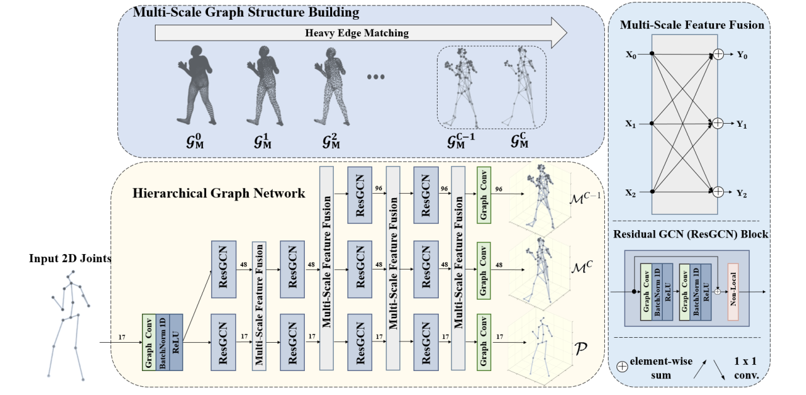

# HGN: Hierarchical Graph Networks for 3D Human Pose Estimation

## Introduction
This repository is the offical [Pytorch](https://pytorch.org/) implementation of [HGN: Hierarchical Graph Networks for 3D Human Pose Estimation (BMVC 2021)](https://arxiv.org/abs/2111.11927).  Because the forms of detected 2d keypoints and ground truth 2d keypoints are quite different, we only give the training and test code when using ground truth 2d keypoints as input.
**Abstract.**

Recent 2D-to-3D human pose estimation works tend to utilize the graph structure formed by the topology of the human skeleton. However, we argue that this skeletal topology is too sparse to reflect the body structure and suffer from serious 2D-to-3D ambiguity problem. To overcome these weaknesses, we propose a novel graph convolution network architecture, Hierarchical Graph Networks (HGN). It is based on denser graph topology generated by our multi-scale graph structure building strategy, thus providing more delicate geometric information. The proposed architecture contains three sparse-to-fine representation subnetworks organized in parallel, in which multi-scale graph-structured features are processed and exchange information through a novel feature fusion strategy, leading to rich hierarchical epresentations. We also introduce a 3D coarse mesh constraint to further boost detail-related feature learning. Extensive experiments demonstrate that our HGN achieves the state-of-the-art performance with reduced network parameters.



## Install guidelines
- We recommend you to use an [Anaconda](https://www.anaconda.com/) virtual environment. Install [PyTorch](https://pytorch.org/) >= 1.2 according to your GPU driver and Python >= 3.7.2, and run `sh requirements.sh`. 

## Directory

### Root

The `${ROOT}` is described as below.

```
${ROOT} 
|-- data
|-- lib
|-- experiment
|-- main
|-- pretrained
|-- smplpytorch
```
- `data` contains data loading codes and soft links to images and annotations directories.
- `lib` contains kernel codes for HGN.
- `main` contains high-level codes for training or testing the network.
- `experiment` contains the outputs of the system, whic include train logs, trained model weights, and visualized outputs.
- `smplpytorch` contains contains kernel codes for SMPL model .

The `data` directory structure should follow the below hierarchy.
```
${ROOT}  
|-- data  
|   |-- Human36M  
|   |   |-- annotations   
|   |   |   | -- Human36M_subject1_camera.json
|   |   |   | -- Human36M_subject1_data.json
|   |   |   | -- Human36M_subject1_joint_3d.json
|   |   |   | -- Human36M_subject1_smpl_camera.json
|   |   |   | -- ....
|   |   |   | -- Human36M_subject13_smpl_camera.json
|   |   |-- J_regressor_h36m_correct.npy
```

- Download the annotations file (SMPL parameters from SMPLify-X, Human36M joints, Camera parameters) [[Annotations](https://jbox.sjtu.edu.cn/v/link/view/4266d27ff78c45a3b1f7d73a27258e65)], and unzip annotations file to corresponding directory.
- All annotation files follow [MS COCO format](https://cocodataset.org/#format-data).
### Pytorch SMPL and MANO layer

- For the SMPL layer, I used [smplpytorch](https://github.com/gulvarol/smplpytorch). The repo is already included in `${ROOT}/smplpytorch`.
- Download `basicModel_f_lbs_10_207_0_v1.0.0.pkl`, `basicModel_m_lbs_10_207_0_v1.0.0.pkl`, and `basicModel_neutral_lbs_10_207_0_v1.0.0.pkl` from [here](https://jbox.sjtu.edu.cn/l/V1LuS1)  to `${ROOT}/smplpytorch/smplpytorch/native/models`.

  
### Experiment

The `experiment` directory will be created as below.
```
${ROOT}  
|-- experiment  
|   |-- exp_*  
|   |   |-- checkpoint  
|   |   |-- graph 
|   |   |-- vis 
```

- `experiment` contains train/test results of Pose2Mesh on various benchmark datasets.
We recommed you to create the folder as a soft link to a directory with large storage capacity.

- `exp_*` is created for each train/test command. 
The wildcard symbol refers to the time of the experiment train/test started.
Default timezone is UTC+9, but you can set to your local time.

- `checkpoint` contains the model checkpoints for each epoch. 

- `graph` contains visualized train logs of error and loss. 

### Pretrained model weights
The pretrained model weights corresponding to the best model when Ground-Truth 2D keypoints are used as input, which can achieve the best results in MPJPE (37.32mm).
```
${ROOT}  
|-- pretrained
|   |-- final.pth.tar
```

## Running HGN


### Train

you can run the below command to train the model with Human36M dataset. We choose the Adam optimizer with the learning rate initialized to
0.001 and decayed by 0.9 per 20 epochs. We train each model for 100 epochs using a mini-batch size of 64.
```
python main/train.py --gpu 0,1 --cfg ./asset/yaml/HGN_human36J_train_human36.yml
```
### Test
Select the config file in ${ROOT}/asset/yaml/ and test. You can change the pretrained model weight, the default path of pretrained model weight is ${ROOT}/pretrained/'. To save sampled outputs to obj files, change TEST.vis value to True in the config file.
Run
```
python main/test.py --gpu 0,1 --cfg ./asset/yaml/HGN_human36J_test_human36.yml
```

### HGN

If you find PoseFormerV2 useful in your research, please consider citing:

```bibtex
@inproceedings{
  title={Hierarchical Graph Networks for 3D Human Pose Estimation},
  author={Li, Han and Shi, Bowen and Dai, Wenrui and Chen, Yabo and Wang, Botao and Sun, Yu and Guo, Min and Li, Chenlin and Zou, Junni and Xiong, Hongkai},
  booktitle={British Machine Vision Conference (BMVC)},
  year={2021}
}
}
```